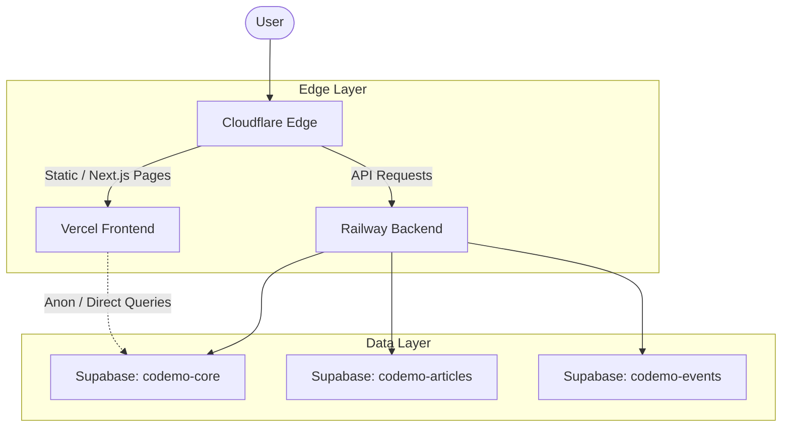

# Architecture

**Last Updated:** 2026-04-26

## System Topology

* **Edge Layer (Cloudflare):** Handles DNS, WAF, Rate Limiting, and static caching. Chosen for robust security and performance at the edge (See ADR-0006).
* **Frontend Host (Vercel):** Next.js App Router application. Chosen for native Next.js support and global CDN (See ADR-0002).
* **Backend Host (Railway):** Node.js API server. Chosen for predictable scaling and ease of Nixpacks deployment (See ADR-0002).
* **Database Layer (Supabase):** Managed PostgreSQL clusters.

## Multi-Database Federation

We use a multi-project database federation strategy to mitigate free-tier limitations and compartmentalise feature data (See ADR-0003).

### Active Supabase Projects

1. `codemo-core`
2. `codemo-articles`
3. `codemo-events`
4. `codemo-elearn`
5. `codemo-projects`

### Federation Rule

Every feature database (e.g., `codemo-articles`) references `user_id` originating from `codemo-core`. Cross-project JOIN operations are forbidden at the database level. The application layer (Backend) is responsible for composing and aggregating data across these projects.

### Scaling & Migration

* A new project is spun up when any free-tier limit approaches the 80% threshold.
* Migration to the Pro tier is evaluated per-project based on strict cost-benefit analysis and MAU limits.

## Communication Contracts

### Frontend ↔ Backend
* REST over HTTPS.
* Sensitive endpoints utilise a custom payload encryption envelope (See ADR-0004).

### Backend ↔ Supabase
* Uses the `service_role` key.
* Server-side only. Bypasses Row-Level Security (RLS) allowing full administrative access.

### Frontend ↔ Supabase
* Uses the `anon` key.
* Strictly protected by RLS policies. Client queries are inherently untrusted.

### Encryption Layers
* Transport level: TLS 1.3 (via Cloudflare).
* Application level: Payload encryption for auth/sensitive data.
* API Level: Response signing and replay protection via request nonces.

## Scalability Boundaries

### Vercel Free Tier
* 100GB bandwidth.
* 100GB-hours edge functions.

### Railway Hobby
* $5 included monthly credit.
* Scales linearly based on memory and CPU usage.

### Supabase Free Tier
* 500MB database size per project.
* 1GB object storage.
* 50,000 Monthly Active Users (MAU).

### Cloudflare Free
* Unlimited proxy bandwidth.
* 3 Page Rules.
* 1 Rate Limit Rule.

*Migration triggers:* When any resource sustains >80% utilisation over a 7-day rolling window, the tech lead must document a Pro-tier upgrade path.
