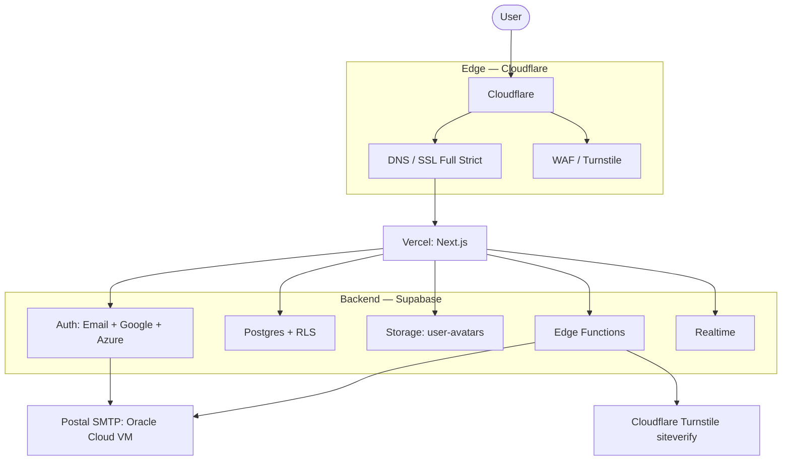

# Architecture

**Last Updated:** 2026-05-07

## System Topology

* **Edge — Cloudflare:** DNS, SSL Full Strict, WAF, Turnstile bot protection. Apex and `www` proxied to Vercel. Email DNS records (MX, SPF, DKIM, DMARC) point at the self-hosted Postal SMTP server on the Oracle VM, grey cloud (not proxied).
* **Frontend — Vercel:** Next.js App Router. Production deploys from the `frontend` branch.
* **Backend — Supabase only:** Postgres, Auth, Storage, Edge Functions, Realtime. There is no separate Node.js API server. The frontend calls Supabase directly; RLS enforces access control.

See [ADR-0008: Drop Railway, Supabase only](adr/0008-drop-railway-supabase-only.md) for the rationale behind dropping the Node.js API tier.

## Components

### Edge Layer (Cloudflare)
* DNS delegation from the registrar (Namecheap or LCN) to Cloudflare. Plan to transfer registration to Cloudflare Registrar after the 60-day lock for at-cost renewal.
* SSL: Full Strict, TLS 1.3 minimum.
* Turnstile: bot protection on the signup, login and password-reset forms.

### Frontend (Vercel)
* Next.js App Router, single workspace at `frontend/`.
* Production branch: `frontend`. Preview deploys for any PR targeting that branch.
* Auth state is hydrated from Supabase via `@supabase/ssr`. Cookies are refreshed on every request by `frontend/proxy.ts`.

### Backend (Supabase, single project)
* **Auth:** Supabase Auth handles password hashing (Argon2id), session tokens, OAuth (Google, Azure for Microsoft), MFA via TOTP, password recovery, and email verification. No custom auth code in the repo.
* **Database:** A single Postgres project. Every table has RLS enabled with explicit policies. Service role key is used only inside Edge Functions; it never reaches the browser.
* **Storage:** `user-avatars` bucket, private, 2 MiB limit, image MIME allowlist. Signed URLs for read.
* **Edge Functions (Deno, TypeScript):**
  * `send-email` — relays through self-hosted Postal SMTP (Oracle Cloud VM) via authenticated SMTP submission.
  * `verify-turnstile` — server-side Turnstile token verification.
  * `delete-account` — full account deletion, cascade, audit log entry.
  * `export-data` — GDPR-style export. Returns a 5-minute signed URL to a JSON blob in Storage.
* **Realtime:** Disabled by default per table; enabled explicitly on tables that need it.

## Communication Contracts

### Frontend ↔ Supabase (direct)
* Anon key, RLS enforced. Used for all user-scoped CRUD.
* No REST shim, no API server. The browser talks to PostgREST and Realtime directly.

### Frontend ↔ Edge Functions
* HTTPS POST with the user's JWT in the `Authorization` header.
* Functions return the standard envelope `{ data, error, meta }`.
* CORS allowlist: `https://codemoteam.org`, `http://localhost:3000`.

### Edge Functions ↔ Supabase
* Service role key from `Deno.env`. Bypasses RLS for admin operations only.

## Data Federation

The MVP runs on a single Supabase project. The earlier multi-project federation has been retired (ADR-0003 superseded by ADR-0008). Rationale:

* The free tier (500 MB DB, 50k MAU, 1 GB storage) is comfortably enough for v1.
* A single project removes cross-project JOIN restrictions and simplifies RLS reasoning.
* If any quota approaches 80% utilisation we revisit.

## Scalability Boundaries

| Resource | Free-tier limit | Trigger to revisit |
|---|---|---|
| Vercel bandwidth | 100 GB / month | 80% sustained |
| Vercel edge functions | 100 GB-hours | 80% sustained |
| Supabase DB | 500 MB | 400 MB stored |
| Supabase MAU | 50 000 | 40 000 |
| Supabase Storage | 1 GB | 800 MB |
| Cloudflare proxy bandwidth | unlimited | n/a |

## Cost Posture (MVP)

Total expected monthly cost: £0. Domain registration runs ~£8/year (LCN cheaper than Namecheap; transfer to Cloudflare Registrar after the 60-day lock for at-cost renewal).
