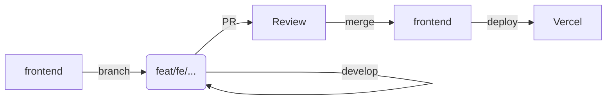
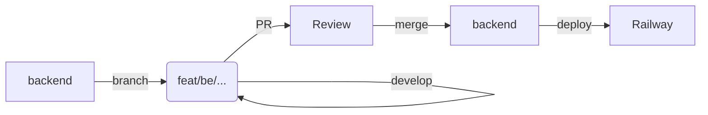
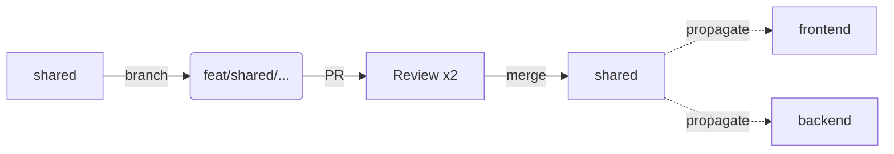

# Branching Strategy

**Last Updated:** 2026-04-26

## Workflow Diagrams

### Frontend Feature Flow


### Backend Feature Flow


### Shared Change Flow


## Step-by-Step Instructions

### Starting a Frontend Feature
1. Ensure your local `frontend` branch is up to date: `git checkout frontend && git pull origin frontend`.
2. Create your feature branch: `git checkout -b feat/fe/short-description`.
3. Develop your feature, committing with conventional commits.
4. Push your branch: `git push -u origin HEAD`.
5. Open a Pull Request against the `frontend` branch.

### Starting a Backend Feature
1. Ensure your local `backend` branch is up to date: `git checkout backend && git pull origin backend`.
2. Create your feature branch: `git checkout -b feat/be/short-description`.
3. Develop your feature, committing with conventional commits.
4. Push your branch: `git push -u origin HEAD`.
5. Open a Pull Request against the `backend` branch.

### Starting a Shared Change
1. Ensure your local `shared` branch is up to date: `git checkout shared && git pull origin shared`.
2. Create your feature branch: `git checkout -b feat/shared/short-description`.
3. Develop and test your changes.
4. Push and open a Pull Request against `shared`. **Note:** This requires two approvals.
5. Upon merge, follow the Shared Propagation Procedure below.

### Hotfixing Production
1. Create a hotfix branch from the affected production branch (e.g., `git checkout -b hotfix/fe/auth-crash frontend`).
2. Fix the issue, add tests to prevent regression, and push.
3. Open a PR with the `hotfix/` prefix. Approvers should expedite review.
4. Merge and monitor the automated deployment.

### Rolling Back a Deploy
* **Frontend:** Use the Vercel dashboard to click "Promote to Production" on the last known good deployment.
* **Backend:** Use the Railway dashboard to redeploy the previous stable commit from the deployments list.
* Immediately after rollback, create an issue tracking the root cause and a subsequent fix PR.

## Conflict Resolution Rules

1. Always rebase your feature branch on the latest target branch before opening a PR:
   ```bash
   git fetch origin
   git rebase origin/frontend
   ```
2. **Never** merge the target branch into your feature branch.
3. Resolve conflicts locally. Do not use the GitHub web UI for non-trivial conflict resolution.

## Shared Propagation Procedure

When a change to `shared` is merged, it must be propagated to `frontend` and `backend`.

1. After the `shared` PR merges, wait for the CI to publish or tag if applicable.
2. Open a propagation PR against `frontend` with the title: `chore(fe): propagate shared <description>`.
3. Open a propagation PR against `backend` with the title: `chore(be): propagate shared <description>`.
4. These PRs require CI to pass but only require one approval each.
